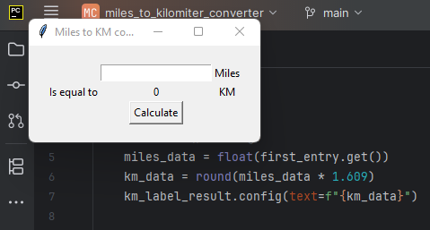
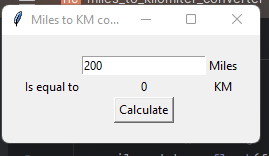
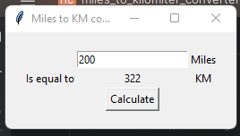

# Mile to Km Converter (Tkinter GUI)

Aplicação simples em Python que converte milhas para quilómetros usando uma interface gráfica com Tkinter.

## 🚀 Funcionalidades
- Interface gráfica intuitiva criada com Tkinter.
- Campo de entrada para valor em milhas.
- Botão de conversão que mostra o resultado em quilómetros.
- Navegação em pastas com **caminho relativo** para aceder ao ficheiro principal.

🛠️ Tecnologias
Python 3.x

Tkinter (biblioteca padrão)

✨ Possibilidades
Este projeto abre portas para inúmeras possibilidades:

Aprimorar a interface gráfica.

Adicionar conversões adicionais (km → milhas, Celsius → Fahrenheit, etc.).

Integrar com ficheiros CSV ou bases de dados.

Publicar versões mais completas para uso real.

## 🖼️ Interface Gráfica

